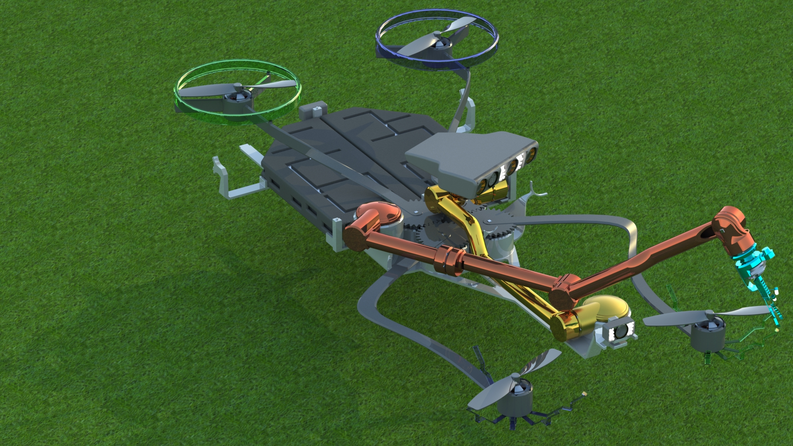

<h1>John-Galt-Line-Hybrid1</h1>

This repository archive the SolidWorks part, assembly and rendering files for a conceptual hybrid robotic-quadcopter design I worked on.

The main design idea was a quadcopter with movable wings and tyres that could operate in air/ground modes. In air mode, the wings will extend and push the tyres to a horizontal position. In ground mode, the tyres will move to a vertical position, forcing the wings to retract. The drone was also equipped with a camera/sensor array and a gripper mechanism on separate multi-jointed robotics arms with multiple degrees of freedom.

This was a second iteration of an earlier conceptual quadcopter design which was my first attempt going all out with SolidWorks. Both designs were personal projects that I found both challenging and fun at the same time.

   

    

